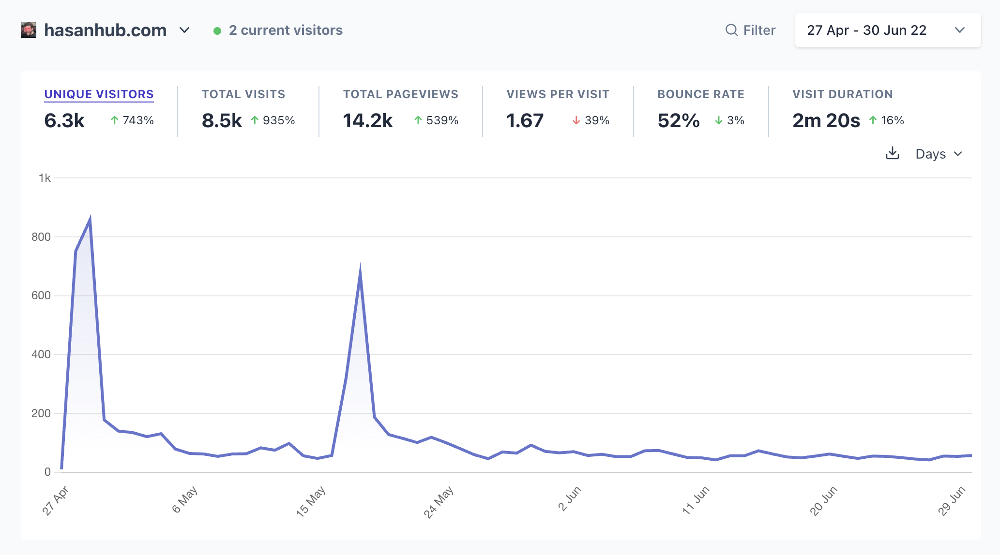
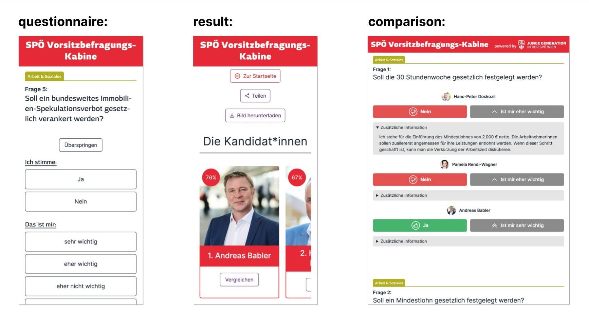
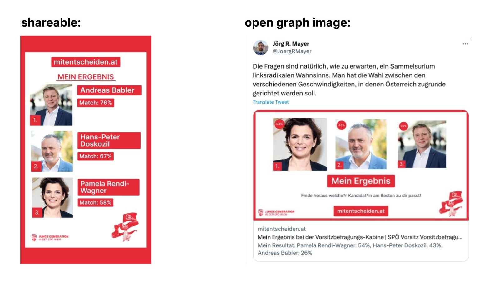
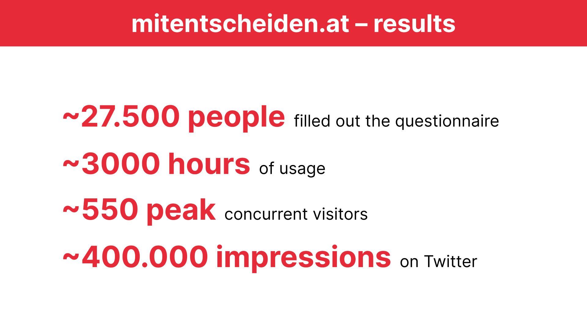
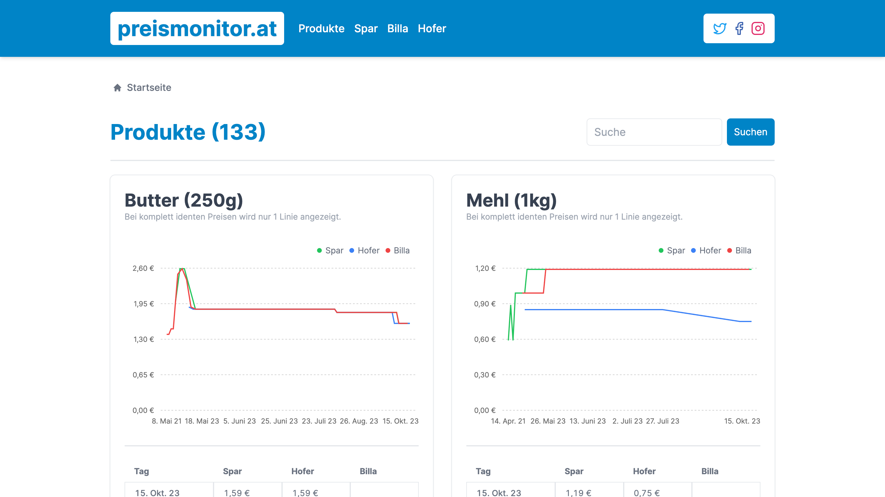
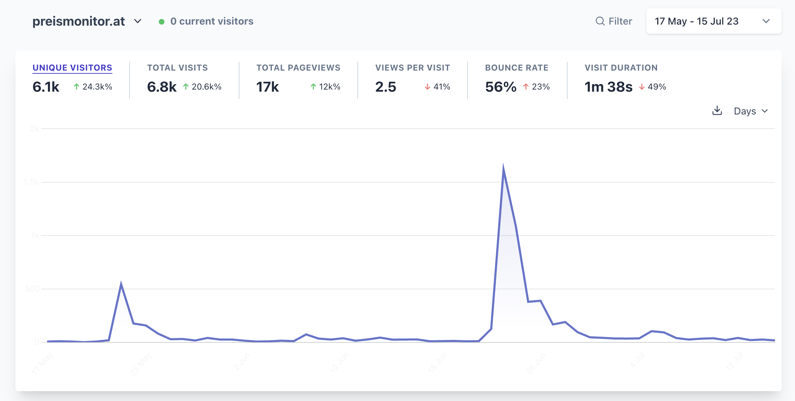
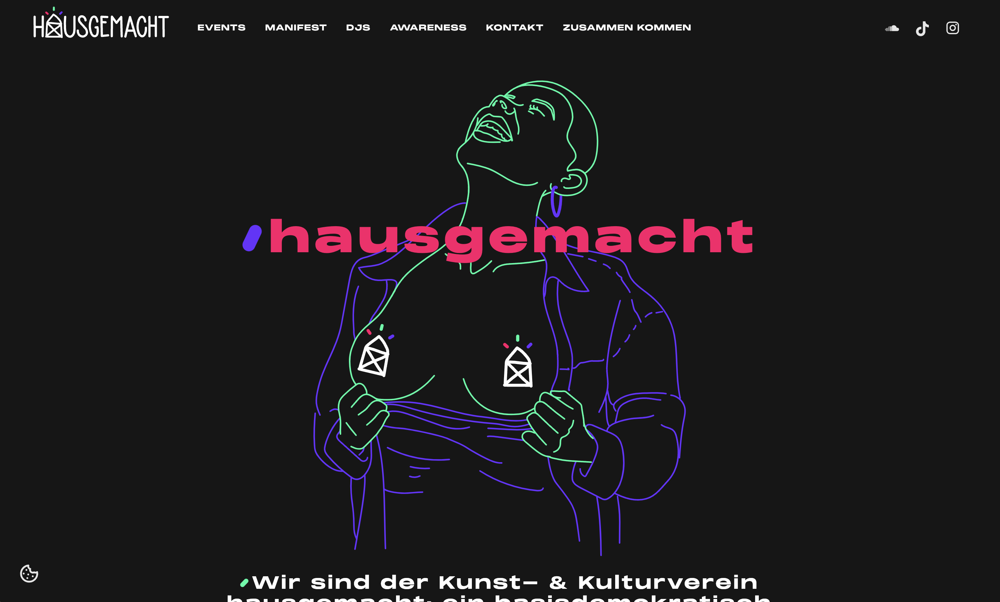
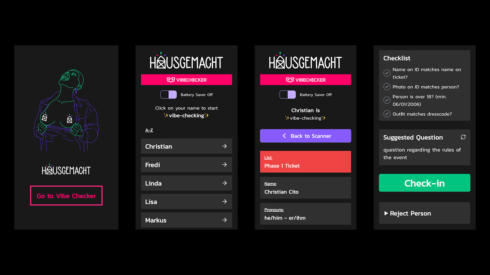

2023 was a wild ride.

I started the year with a new job, got fired after 3 weeks, got involved in politics, made apps for sex positive parties, started another new job, was invited to consult an Austrian minister on a new law and much more.

## I launched my first project to 30.000 people

The political streamer [Hasanabi](https://twitch.tv/hasanabi) allows his fans to clip his stream VODs, upload those clips to YouTube and make money from his content.

Due to this, there are 100+ different YouTube channels dedicated to him. Some of [these](https://www.youtube.com/@HasanReactionsTwo) [fan](https://www.youtube.com/@DailyDoseOfHasanAbi) [channels](https://www.youtube.com/@HasanabiProductions) have over 100.000 subscribers. I saw the opportunity to build something useful for his community by creating a web app which aggregates all of these channels into one feed. It's called [hasanhub.com](https://hasanhub.com).

I first launched the project in April 2022 and Hasan looked at it on his stream while live to roughly 30.000 people.

[Post on X](https://x.com/chrcit/status/1519797007904346115)

The active users stagnated at around 30 per day until in December 2022 and January 2023 Hasan opened it on stream again. After that exposure, the active users went up to 300-400 per day.

[Post on X](https://x.com/chrcit/status/1607794241467723778)

In January 2023 I decided to create a separate Twitter account ([@hasanhub_com](https://twitter.com/hasanhub_com)) for the project and had a tweet go viral with ~500.000 impressions:

[Post on X](https://x.com/hasanhub_com/status/1623636677158641665)

## I got my dream job (and was fired after 3 weeks)

Between July and September 2022 I spent ~50 hours researching and ideating on a link-in-bio style microsite builder. The concept was that instead of just links to external sites, the app would automatically fetch the latest content from Twitter, Instagram, YouTube, Spotify, RSS, etc.

I submitted the idea to an incubator but it was rejected.

In January 2023 I talked about it on Twitter and got a reply from a company called Bento. They were building just that and were looking for a founding product engineer:

[Post on X](https://x.com/joinbento/status/1610738950292766728)

After a few rounds of interviews and a 1 day [hackathon](https://github.com/chrcit/hackathon-visual-html-editor), I received an offer and accepted it.

For my first week I traveled to Berlin to meet the team:

[Post on X](https://twitter.com/chrcit/status/1630996521738010634)

My first feature was a gorgeous settings UI + some auth related stuff. I shipped it after 3 days:

[Post on X](https://x.com/chrcit/status/1631688805915787265)

Besides the regular marketing by Bento I decided to also post about it on multiple subreddits. The posts got ~300.000 impressions, thousands of upvotes and hundreds of comments. It also drove a good bit of extra sign-ups to Bento.

> [I started a new job this week and shipped this gorgeous settings UI yesterday](https://www.reddit.com/r/webdev/comments/11hvwp9/i_started_a_new_job_this_week_and_shipped_this/) — by [u/chrcit](https://www.reddit.com/user/chrcit/) in [webdev](https://www.reddit.com/r/webdev/)

After my second week I shipped new widgets for Figma, Dribbble and Behance:

[Post on X](https://x.com/chrcit/status/1636012896713883650)

In my third week I worked on interactive media player widgets for Spotify with beautiful animations:

[Post on X](https://x.com/joinbento/status/1638206419194314755)

But before I could ship those I got fired.

Earlier in the same week I asked to get a few days more time to work on the next feature. I had been working 50–60 hours per week up to that point and wanted to take the weekend off to recharge.

I told my CTO that developing and launching a big, new feature every week wouldn't be sustainable for me long-term. He told me that that is startup life and that we could talk more about it on Friday with the CEO. On Friday I got fired for not being a good fit.

10 weeks later Bento [was sold to Linktree](https://x.com/joinbento/status/1665837936607379456) only 6 months after it was first launched. This is good for Bento and amazing for Linktree.

I don't hold any ill will towards the people at Bento. In the few weeks I worked there I learned a lot about product development, engineering, design, and marketing from the team. I also figured out what I want and don't want from a job.

## An app I made helped get a socialist elected

[Georg](https://georgwindhaber.com), a good friend of mine, is active in the SPÖ (the social democratic party of Austria). In the early summer of 2023 they were holding an internal election for the new party leader.

The Junge Generation ("young generation" in German), the youth wing of the party wanted to create an app to help people decide which of the internal candidates to vote for.

Georg asked me if I wanted to collaborate on this application and I agreed. The concept was modelled after [wahlkabine.at](https://wahlkabine.at), a political questionnaire which helps you find the party which best represents your political views.

We went from idea to launch of [mitentscheiden.at](https://mitentscheiden.at) in 3 weeks.

The 3 candidates all answered 42 questions via the app and the users could then answer the same questions. After finishing the questionnaire the user is shown how much they match with the 3 candidates as well as multiple pages to compare their answers with the candidates.

The launch was a big success with around ~27.000 people filling out the questionnaire. The app also went viral on Twitter with over 400.000 impressions and [multiple](https://twitter.com/NicolaWerdenigg/status/1650069601340858368) [high](https://twitter.com/pablodiabolo/status/1650068482271182853) [profile](https://twitter.com/florianklenk/status/1650134987172200452) [people](https://x.com/Natascha_Strobl/status/1650056393100083201) in the Austrian political bubble sharing it.

It was covered by [multiple](https://www.puls24.at/news/politik/spoe-wahl-41-fragen-und-die-antworten-von-babler-doskozil-und-rendi-wagner/295388) [national](https://kurier.at/politik/inland/test-fuer-nicht-mitglieder-welcher-spoe-kandidat-wuerde-zu-ihnen-passen/402422507) [newspapers](https://www.derstandard.at/story/2000145782957/was-man-ueber-die-rote-vorsitzwahl-wissen-muss), [meme](https://www.instagram.com/p/CrX6u3nMem0/) [pages](https://www.instagram.com/p/CrYPyLWsp7w) and the largest TV news program of the country (ZIB 1).

A question regarding removing abortion from the criminal code resulted in a controversy. The more conservative candidate (and front-runner) Doskozil at first answered with "no" but after a backlash on social media changed his answer to "yes".

The incumbent candidate Rendi-Wagner dropped out of the race after she came in last in a party wide poll.

The election was held in June and ~600 party officials voted. Initially it was announced that the more conservative candidate Doskozil won with 52% of the vote.

But a few days later it was discovered that there was a [mistake in the Excel sheet](https://www.theguardian.com/world/2023/jun/05/austrian-social-democrats-announce-wrong-leader-after-technical-error) used to calculate the results. The votes were flipped by accident and actually the more radical candidate Babler won.

Due to the close result it's possible that the controversy around the abortion question could have swayed the election in Babler's favor.

2 months after the launch I used the project as a case study for my first dev talk which I held at the Technical University of Vienna. I uploaded the recording to YouTube and got over 1000 views on it in a few days.

[Talk recording on YouTube](https://www.youtube.com/watch?v=LsgIRqjvit0)

I also joined the party and founded the Web Task Force together with [Georg Windhaber](https://georgwindhaber.com).

We are currently working on multiple web projects to campaign for the upcoming national election in September 2024 as well as the European Union elections in July.

[Post on X](https://x.com/chrcit/status/1707081180238012491)

## A (shitty) website I made might change the law

In 2022 and 2023 inflation was rising in Austria and all over the world. A big driver was the increase in grocery prices.

In May 2023 Martin Kocher, the Austrian Minister for Labour and Economy announced plans for a state grocery price tracker for a few selected products. The plan was quite vague and it wouldn't launch anytime before fall 2023.

[Lukas](https://twitter.com/LeKaeferle), a good friend of mine, suggested that we should just build this ourselves.

We went from idea to launch in 2 weeks. The site is called [preismonitor.at](https://preismonitor.at) and it's a simple website which shows the price development of ~300 products in 3 supermarkets.

Even though we launched as fast as possible there were 3 other price trackers that were released before our site:

- [heisse-preise.io](https://heisse-preise.io) by [Mario Zechner](https://twitter.com/badlogicgames)
- [teuerungsportal.at](https://teuerungsportal.at) by [Bernhard Ruckenstuhl](https://twitter.com/_zumpel)
- [preisrunter.at](https://preisrunter.at) by [David Wurm](https://twitter.com/DerDavidus)

I reached out to all of them and we started a group chat.

Both Lukas and I didn't have much time to work on the project after launch. Due to the other projects existing we didn't see a strong need to continue developing it further for the moment.

We still got a few mentions in both [national](https://www.derstandard.at/story/3000000176002/l) and [international](https://www.wired.com/story/heisse-preise-food-prices/) media.

[Post on X](https://x.com/preismonitor_at/status/1709135625121624157)

In July the Austrian [Federal Competition Authority](https://www.bwb.gv.at/en/) reached out to us and the other grocery price providers to ask us a few questions about our projects. They have been investigating the supermarket industry since fall 2022.

Our answers were then used in [a final report](https://www.bwb.gv.at/fileadmin/user_upload/Fokuspapier_Preisvergleichsplattformen_Sept_2023_barrierefrei_14.09.2023.pdf) which was handed over to Martin Kocher, the Minister of Labour and Economy.

The report recommended implementing a law which would force supermarkets to report their price data to the ministry which then would make it available via an API.

This would enable developers, researchers and journalists to utilize the data for many varied use cases.

[Post on X](https://x.com/badlogicgames/status/1706692838539325789)

In September the Minister for Labour and Economy invited us to consult him on the exact implementation of the law. We were invited together with our friends from [heisse-preise.io](https://heisse-preise.io), [teuerungsportal.at](https://teuerungsportal.at) and [preisrunter.at](https://preisrunter.at).

[Post on X](https://x.com/chrcit/status/1706731529022378346)

In mid October our crawler stopped working and both Lukas and I were too busy to fix it. We decided to pause development until we have more time.

We intend to dump our crawler and instead use the data from [heisse-preise.io](https://heisse-preise.io) or the government API (if it actually comes).

A long-term idea is to create a grocery list app which is enhanced by this pricing data. This would allow users to see which supermarket is the cheapest for their current grocery list.

## I make apps for sex positive parties

[hausgemacht](https://hausgemacht.org) ("homemade" in German) is the biggest techno collective in Vienna. They organize events in various clubs in the city. Besides regular techno clubbings they also host sex positive parties.

The people behind it are focused on creating a safeR space for their guests, especially FLINTA* people. They make this possible via an online application process before the sex positive parties and a large awareness team looking after the safety and well-being of the guests during the event.

After attending my first event in February 2023 I decided I wanted to join the collective. I reached out to them and offered to support them with their custom-made application process.

After meeting with the internet team and getting to know each other they invited me to become a member of the collective.

The application process is handled via a web app built by members of the collective. Because of the sensitive nature of the data the app is built with a strong focus on data protection and privacy.

[Alois Paulin](http://apaulin.com) built the backend which is architected to minimize data stored and disclosed to members of the organisation. There is also great care to ensure that all personal data is encrypted and stored securely. Once the need for the data is gone it is deleted.

[Patrick Ludewig](https://twitter.com/Maybach) designed and built the frontend. Vlad I. acted as a product owner/manager for this and many other projects.

This year I focused on improving and extending the way we check in our guests.

The team built a web app which allows guests to anonymously check in via a passport scanner. The app connects to the scanner and matches the name against the ticketing system. The person selecting the guest will only see the image read from the passport but will not see the name.

The data from the passport (i.e. the image) is only processed and transported in a secure local network. It never leaves the local network and is deleted immediately after the event.

This approach is quite innovative and Alois even wrote [a paper](https://dl.acm.org/doi/10.1145/3603304.3604067) about it.

[Post on X](https://x.com/chrcit/status/1699485759038714134)

Together with Alois I refactored the app to stabilize the integration of the passport scanner and simplify the UI for the end user. We also trialed processing other IDs via OCR.

A few hours before an event in September our backend server went down and we didn't have time to port it to another infrastructure.

I quickly built a new web app for scanning the ticket QR code and enriching it with our guest data. Our team was then able to use the app to check in or reject guests at the door.

[Post on X](https://x.com/chrcit/status/1702771997296468365)

I kept iterating on this app for 2 other events and added many new features. The app is now used at all our events and is the main tool for checking in guests.

The plan is to eventually merge the passport scanner and the ticket scanner into one application so both methods can be used interchangeably.

Our focus for 2024 is to unify all the different systems into one web application. Over the next 2 years this will evolve into a bespoke event management system for the collective.

## Scaling a media site to millions of users

After getting fired I applied to around 15 companies and got a few offers.

I accepted an offer from RegionalMedien Austria. They're a media company which publishes 200+ regional print newspapers in Austria as well as an online portal: [meinbezirk.at](https://meinbezirk.at).

The current online platform is managed by an external provider. In 2023 the company started working on an in-house developed relaunch of the whole site.

Currently the site gets around 1.000.000 unique daily visitors. The goal is to transition route by route from the old platform to the new one.

In my first month I got promoted to Lead Full-Stack Developer and started taking ownership over the development process.

I'm very excited to work on a project of this scale.

## Starting an agency?

I've been freelancing since early high school (2012) and after getting fired I briefly thought about doing it full-time.

To get something out there I built a [coming soon page](https://madebyarthouse.com) in a few hours while hungover and launched it on Twitter:

[Post on X](https://x.com/chrcit/status/1639031871148535808)

After a few weeks the idea subsided again but I wanted to keep freelancing on the side to fund some other projects of mine.

I started working with a digital agency called [Anwert](https://anwert.io) where I do web consulting, build WordPress plugins and create some [social media](https://www.instagram.com/p/Cyi-jWioQs4/) [posts](https://www.instagram.com/p/CzwIW31oi1H/).

Over the summer I started supporting [Mindnode](https://mindnode.com), one of the most popular Mac/iOS productivity apps, with their website.

My biggest freelance project in 2023 was the relaunch of [houseofstrauss.at](https://houseofstrauss.at) and [zoegernitz.com](https://zoegernitz.com).

Both sites were commissioned by a [real estate company](https://herztraum.at/) which bought and renovated the Casino Zögernitz which used to be the old concert halls of Johann Strauss and his son. The building now houses a museum, a restaurant, and a concert hall/event location.

The project's creative director [Georg Brennwald](https://brennwald.eu) designed 20+ components for the site.
I then implemented them as full-stack components in [Next.js](https://nextjs.org) which can be composed together via a headless page builder inside of [Sanity](https://sanity.io).

I'm still not 100% certain where to take Arthouse in the future, but for, now I'm happy to have it as a vehicle for my freelancing work.

If you are interested in collaborating on a project with me you can reach out via [email](mailto:christian.cito@arthouse.is). I offer an initial free 30 minutes consulting call and after that my rate is 100€ per hour.

## Supporting journalism for and from people with disabilities

[andererseits](https://andererseits.org) ("otherwise" in German) is a media startup based in Vienna about, for and from people with disabilities. [Markus](https://twitter.com/MajorosMarkus), a good friend of mine told me about them early 2023 and suggested that I could support them with their IT systems.

I was interested because I have a disability myself due to an accident 6 years ago and always wanted to work on a project which helps people with disabilities.

[Post on X](https://x.com/chrcit/status/1633395809763860480)

In fall and winter 2023 I met up with [Lukas](https://andererseits.org/author/lukas-burnar/), one of the co-founders of andererseits and I automated some of their internal processes. These automations have saved them around 10% of their person hours per week which allows them to focus more on their core business.

At the end of the year I also wrote a newsletter about my experience with disability:

[Post on Instagram](https://www.instagram.com/p/C1cZlHJs7s0/)

## Prospects for 2024

I could have never imagined how 2023 would turn out. The year brought tons of new experiences and many shifts in my perspective on life and success.

In 2024 I'm going to continue working on many of the projects which started in 2023. For the first time in my life I'm not unsure about what I want to spend my time on.

The only new thing planned in 2024 is creating YouTube videos about my projects and the societal context around them.

---

Thank you for reading this far. If you want to stay up to date with my projects you can follow me on [Twitter](https://twitter.com/chrcit), [YouTube](https://youtube.com/@chrcit) or [Instagram](https://www.instagram.com/chrcit/).
