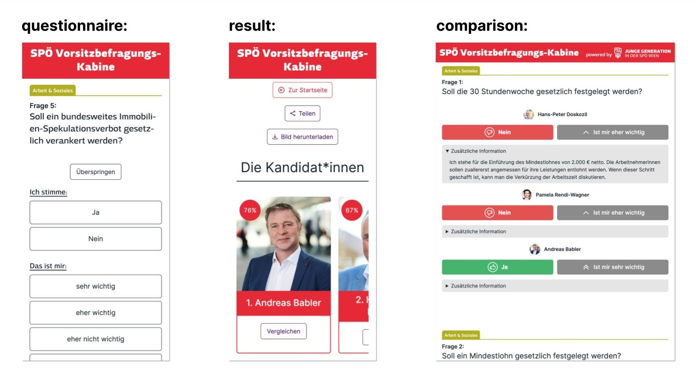
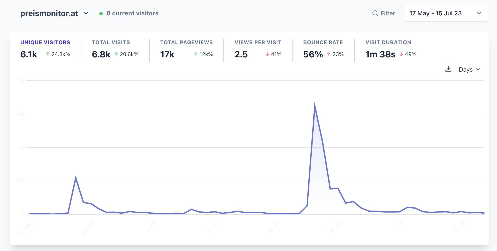

import { Tweet } from "@astro-community/astro-embed-twitter";
import AndererseitsInstagram from "../../components/embeds/AndererseitsInstagram.astro"
import ExternalLink from "../../components/ExternalLink.astro"
import { YouTube } from "@astro-community/astro-embed-youtube";

2023 was a wild ride. I started the year with a new job, got fired after 3 weeks, got involved in politics, made apps for sex positive parties, got a new job, was invited to consult a minister on a new law and much more.

## I launched my first project to 30.000 people

In 2022 I launched my first side project. The <ExternalLink href="https://twitch.tv/hasanabi">political streamer Hasanabi</ExternalLink> allows his fans to clip his stream VODs, upload them to Youtube and monetize his content.

Due to this there are 100+ different Youtube channels dedicated to him. I saw the opportunity to build something useful by creating a web app which aggregates all of these channels into one feed. It's called <ExternalLink href="https://hasanhub.com">hasanhub.com</ExternalLink>.

I first launched the project in April 2022 and Hasan looked at it on his stream while live to roughly 30.000 people.

<Tweet id="https://x.com/chrcit/status/1519797007904346115" />

The active users stagnated at around 30/day until in December 2022/January 2023 Hasan opened it on stream again. After that exposure the active users went up to 300-400/day.

<Tweet id="https://x.com/chrcit/status/1607794241467723778" />

In Janauary 2023 I decided to create a seperate Twitter account (<ExternalLink href="https://twitter.com/hasanhub_com">@hasanhub_com</ExternalLink>) for the project and had a tweet go viral with ~500.000 impressions:

<Tweet id="https://x.com/hasanhub_com/status/1623636677158641665" />

Check out the [project page for Hasanhub](/projects/hasanhub-com).

## I got my dream job (and was fired after 3 weeks)
In August/September 2022 I spent ~50 hours researching and ideating on a link-in-bio style microsite builder. The concept was that instead of just links to external sites the app would automatically fetch the latest content from Twitter, Instagram, YouTube, Spotify, RSS, etc.

I submitted the idea to an incubator but it was rejected. 

In January 2023 I talked about it on Twitter and got a reply from a company called Bento. They were building just that and were looking for a founding product engineer:
<Tweet id="https://x.com/joinbento/status/1610738950292766728" />

After a few rounds of interviews and a <ExternalLink href="https://github.com/chrcit/hackathon-visual-html-editor">1 day hackathon</ExternalLink> I received an offer and accepted it.

For my first week I traveled to Berlin to meet the team:
<Tweet id="https://twitter.com/chrcit/status/1630996521738010634" />

My first feature was a gorgeous settings UI + some auth related stuff. I shipped it after 3 days:
<Tweet id="https://x.com/chrcit/status/1631688805915787265" />

Besides the regular marketing Bento did I decided to post the feature on Reddit. The post got ~300.000 impressions, thousands of upvotes and hundreds of comments. It also drove a good bit of extra sign ups for the app.

<blockquote
  class="reddit-embed-bq"
  style="height:500px"
  data-embed-height="689"
>
  <ExternalLink href="https://www.reddit.com/r/webdev/comments/11hvwp9/i_started_a_new_job_this_week_and_shipped_this/">
    I started a new job this week and shipped this gorgeous settings UI
    yesterday
  </ExternalLink>
    by<ExternalLink href="https://www.reddit.com/user/chrcit/">u/chrcit</ExternalLink> in<ExternalLink href="https://www.reddit.com/r/webdev/">webdev</ExternalLink>
</blockquote>

After my second week I shipped new widgets for Figma, Dribbble and Behance:
<Tweet id="https://x.com/chrcit/status/1636012896713883650" />

In my third week I worked on interactive widgets for Spotify which act as mini jukeboxes with beautiful animations:
<Tweet id="https://x.com/joinbento/status/1638206419194314755" /> 

But before I could ship those I got fired. 

Earlier in the same week I asked to get a few days more time to work on the next feature. I had been working 50-60 hours/week up until that point and wanted to take the weekend off to recharge.

I told my CTO that I couldn't be happy long-term if I had a deadline to ship a big feature every week. He told me that that is startup life and that we'll talk more about it on Friday with the CEO. On Friday I got fired for not being a good fit.

10 weeks later  Bento <ExternalLink href="https://x.com/joinbento/status/1665837936607379456">was sold to Linktree</ExternalLink> only 6 months after it was first launched. This is good for Bento and amazing for Linktree.

I don't hold any ill will towards the people at Bento. In the few weeks I worked there I learned a lot and figured out what I want from a job as well as what I don't want.

## An app I made helped get a socialist elected
In the weeks after getting fired I had a bit of a chip on my shoulder. 

A <ExternalLink href="https://georgwindhaber.com">good friend of mine</ExternalLink> is active in the youth wing of the SPÖ (the social democratic party of Austria).
They were holding an internal election for the new party leader and the youth wing wanted to create an app to help people decide who to vote for. 

He asked me if I wanted to collaborate on this and I agreed. The concept was modelled after <ExternalLink href="https://wahlkabine.at">wahlkabine.at</ExternalLink> which is a political quiz which helps you find the party which best represents your views.

In around 3 weeks we went from idea to launch of <ExternalLink href="https://mitentscheiden.at">mitentscheiden.at</ExternalLink>.

The three candidates all answered 42 questions via the app and the users could then answer the same questions. After finishing the quiz the user is shown how much they match with the 3 candidates as well as multiple pages to compare their answers with the candidates.

The launch was a big success with around ~27.000 people filling out the 42 question quiz. The app also went viral on Twitter with over 400.000+ impressions and multiple high <ExternalLink href="https://twitter.com/NicolaWerdenigg/status/1650069601340858368">multiple</ExternalLink> <ExternalLink href="https://twitter.com/pablodiabolo/status/1650068482271182853">high</ExternalLink> <ExternalLink href="https://twitter.com/florianklenk/status/1650134987172200452">profile</ExternalLink> <ExternalLink href="https://x.com/Natascha_Strobl/status/1650056393100083201">people</ExternalLink> sharing it.

It was covered by [multiple](https://www.puls24.at/news/politik/spoe-wahl-41-fragen-und-die-antworten-von-babler-doskozil-und-rendi-wagner/295388) [national](https://kurier.at/politik/inland/test-fuer-nicht-mitglieder-welcher-spoe-kandidat-wuerde-zu-ihnen-passen/402422507) [newspapers](https://www.derstandard.at/story/2000145782957/was-man-ueber-die-rote-vorsitzwahl-wissen-muss), TV stations and [meme](https://www.instagram.com/p/CrX6u3nMem0/) [pages](https://www.instagram.com/p/CrYPyLWsp7w).

A question regarding removing abortion from the criminal code resulted in a controversy. The more conservative candidate (and front-runner) Doskozil at first answered with “no” but after a backlash on social media changed his answer to “yes”.

The incumbent candidate Rendi-Wagner dropped out of the race after she came in last in a party wide poll.

The election was held in June and ~600 party officals voted. Initially it was announced that the more conservative candidate Doskozil won with 52% of the vote. 

But a few days later it was discovered that there was a [mistake in the Excel sheet](https://www.theguardian.com/world/2023/jun/05/austrian-social-democrats-announce-wrong-leader-after-technical-error) used to calculate the results. The votes were flipped by accident and actually the more radical candidate Babler won.

2 months after the launch I used the project as a case study for my first dev talk which I held at the Technical University of Vienna. I uploaded the recording to YouTube a bit later. It got over 1000 views in a few days and with that I got a first taste for content creation.

<YouTube id="https://www.youtube.com/watch?v=LsgIRqjvit0&" />

Check outh the [project page for mitentscheiden.at](/projects/mitentscheiden.at).

## A (shitty) website I made might change the law
In 2022 and 2023 inflation was rising in Austria and all over the world. A big driver was the increase in grocery prices.

In May 2023 the Austrian minister for labour and economics announced plans for a state grocery price tracker for a few selected products. The plan was quite vague and it wouldn't launch anytime before fall 2023.

A good friend of mine, <ExternalLink href="https://twitter.com/LeKaeferle">Lukas Käferle</ExternalLink>, suggested that we should just build this ourselves.

We went from idea to launch in 2 weeks. The site is called <ExternalLink href="https://preismonitor.at">preismonitor.at</ExternalLink> and it's a simple website which shows the price development of ~300 products in 3 supermarkets.

Even though we launched as fast as possible there were 3 other price trackers that launched before us:

- <ExternalLink href="https://heisse-preise">heisse-preisse.io</ExternalLink> by <ExternalLink href="https://twitter.com/badlogicgames">Mario Zechner</ExternalLink>
- <ExternalLink href="https://teuerungsportal.at">teuerungsportal.at</ExternalLink> by <ExternalLink href="https://twitter.com/_zumpel">Bernhard Ruckenstuhl</ExternalLink>
- <ExternalLink href="https://preisrunter.at">preisrunter.at</ExternalLink> by <ExternalLink href="https://twitter.com/DerDavidus">David Wurm</ExternalLink>

I reached out to all of them and we started a group chat.

Both Lukas and I didn't have much time to work on the project after launch. Due to the other projects existing as well there wasn't too much need for us to continue developing.

We still got a few  mentions in both <ExternalLink href="https://www.derstandard.at/story/3000000176002/l">national</ExternalLink> and <ExternalLink href="https://www.wired.com/story/heisse-preise-food-prices/">international</ExternalLink> media.

In July the Austrian <ExternalLink href="https://www.bwb.gv.at/en/">Federal Competition Authority</ExternalLink> reached out to us and the other price tracker creators to ask us a few questions about the projects. They have been investigating the supermarket industry since fall 2022.

Our answers were then used in <ExternalLink href="https://www.bwb.gv.at/fileadmin/user_upload/Fokuspapier_Preisvergleichsplattformen_Sept_2023_barrierefrei_14.09.2023.pdf"> a final report</ExternalLink> which was handed over to Martin Kocher, the minister of Labour and Economy.

The report recommended to create a law which would force supermarkets to report their price data to the ministry which then would make it available via an API.

This would enable developers, researchers and journalists to utilize the data for many different use cases.
  
<Tweet id="https://x.com/badlogicgames/status/1706692838539325789?s=20" />

In September the minister for Labour and Economics invited us to consult him on the exact implementation of the law. We were invited together with our friends from <ExternalLink href="https://heisse-preise">heisse-preisse.io</ExternalLink>, <ExternalLink href="https://teuerungsportal.at">teuerungsportal.at</ExternalLink> and <ExternalLink href="https://preisrunter.at">preisrunter.at</ExternalLink>.

<Tweet id="https://x.com/chrcit/status/1706731529022378346?s=20" />

In mid October our crawler stopped working and both Lukas and I were too busy to fix it. We decided to pause development until we have more time.

We are planning on dumping our crawler and instead use the data from <ExternalLink href="https://heisse-preise.io">heisse-preisse.io</ExternalLink> or the government API (if it actually comes).

A long-term idea is to create a grocery list app which is enhanced by this pricing data. This would allow users to see which supermarket is the cheapest for their current grocery list.

Check out the [project page for Preismonitor](/projects/preismonitor-at).

## I make apps for sex positive partys
<ExternalLink href="https://hausgemacht.org">__hausgemacht__</ExternalLink> ("homemade" in German) is the biggest techno collective in Vienna. They organize events in various clubs in the city. Besides regular techno clubbings they also host sex positive events.

The people behind it are focussed on creating a safe space for their guests, especially FLINTA* people. They make this possible via an online application process before the events and a large awareness team looking after the safety and well-being of the guests during the event.

After attending my first event in February 2023 I decided I wanted to join the collective. I reached out to them and offered to support them with their custom made application process.

After meeting up with the internet team and getting to know each other they invited me to join the collective.

The application process is done via a custom made web app built by members of the collective. Because of the sensitive nature of the data the app is built with a strong focus on data protection and privacy.

<ExternalLink href="http://beyondbureaucracy.org/">Alois Paulin</ExternalLink> (one of our members) built the backend which is architected to minimize data stored and disclosed to members of the organisation. There is also great care to ensure that all personal data is encrypted and stored securely. Once the need for the data is gone it is deleted.

This year I focussed on improving and extending the way we check-in our guests. 

The team built a web app which allows guests to anonymously check-in via a passport scanner. The app connects to the scanner and matches the name against the ticketing system. The person selecting the guest will only see the image read from the passport but will not see the name.

The data from the passport (i.e. the image) is only processed and transported in a secure local network. It never leaves the local network and is deleted immediatley after the event.

<Tweet id="https://x.com/chrcit/status/1699485759038714134" />

Together with Alois I refactored the app to stabilize the integration of the passport scanner and simplify the UI for the end user. We also trialed processing other IDs via OCR.

A few hours before an event in September our backend server went down and we didn't have time to port over the backend.

I quickly built a new web app for scanning the ticket QR code and enriching it with our guest data. Our team was then able to use the app to check in or reject guests at the door.

<Tweet id="https://x.com/chrcit/status/1702771997296468365" />

I kept iterating on this app for 2 other events and added many new features. The app is now used at all our events and is the main tool for checking in guests.

The plan is to eventually merge the passport scanner and the ticket scanner app into one application so both methods can be used interchangeably.

Our focus for 2024 is to unify all our different applications into one unified web applicaton. Over the next 2 years this will evolve into a bespoke event management system for the collective integrating many different tools and services.

Check out the [project page for hausgemacht](/projects/hausgemacht).

## Scaling a media site to millions of users
After getting fired I applied to around 15 companies and got a few offers.

I accepted an offer from RegionalMedien Austria. They're a media company which publishes 200+ regional print newspapers in Austria as well as an online portal: <ExternalLink href="https://meinbezirk.at">meinbezirk.at</ExternalLink>.

The current online platform is managed by an external provider. In 2023 the company started working on an in-house developed relaunch of the whole site.

Currently the site gets around 1.000.000 unique daily visitors. The goal is to transition route by route from the old platform to the new one.

In my first month I got promoted to Lead Full-Stack Developer and started taking ownership over the development process.

I'm very excited to work on a project of this scale.

## Starting an agency?
I've been freelancing since early high school (2012) and after getting fired I had a brief moment where I thought about doing it full-time.

To get something out there I built a <ExternalLink href="https://madebyarthouse.com"> coming soon page</ExternalLink> in a few hours while hungover and launched it on Twitter:

<Tweet id="https://x.com/chrcit/status/1639031871148535808" /> 

After a few weeks the idea subsided again but I wanted to keep freelancing on the side to fund some other projects of mine.

I started working with a digital agency called Anwert where I do web consulting, build WordPress plugins and some <ExternalLink href="https://www.instagram.com/p/Cyi-jWioQs4/">social</ExternalLink> <ExternalLink href="https://www.instagram.com/p/CzwIW31oi1H/">media</ExternalLink>. 

Over the summer I started supporting <ExternalLink href="https://mindnode.com">Mindnode</ExternalLink> with their Website.

My biggest freelance project in 2023 was the relaunch of <ExternalLink href="https://houseofstrauss.at">House of Strauss</ExternalLink> and <ExternalLink href="https://zoegernitz.at">Zögernitz</ExternalLink>. 

Both sites were commisoned by a <ExternalLink href="https://herztraum.at/">real estate company</ExternalLink> which bought and renovated the Casino Zögernitz which used to be the old concert halls of the Johann Strauss and his son. The building now houses a museum, a restaurant and a concert hall/event location.

The project's manager and creative director <ExternalLink href="https://brennwald.eu">Georg Brennwald</ExternalLink> designed 20+ components for the site.
I then implemented them as full-stack components in <ExternalLink href="https://nextjs.org">Next.js</ExternalLink> which can be composed together via a headless page builder inside of <ExternalLink href="https://sanity.io">Sanity</ExternalLink>.

I'm still not 100% certain where to take Arthouse in the future but for now I'm happy to have it as a vehicle for my freelancing work.

If you are interested in collaborating on a project with me you can reach out via <ExternalLink href="mailto:christian.cito@arthouse.is">email</ExternalLink>. I offer a free 30 minutes consulting call and after that my rate is 100€/hour.

## Supporting journalism for and from people with disabilities
andererseits (=otherwise) is a media startup based in Vienna about/for/from people with disabilities. A <ExternalLink href="https://twitter.com/MajorosMarkus">good friend of mine</ExternalLink> told me about them early 2023 and suggested that I could offer my support in their IT systems.

The proejct was interesting to me because I have a disability myself due to an accident 6 years ago and always wanted to work on a project which helps people with disabilities.

<Tweet id="https://x.com/chrcit/status/1633395809763860480" />

In fall and winter 2023 I met up with one of the co-founders and I automated some of their internal processes. This has saved about 10h/week of time and allowed them to focus on their core business.

At the end of the year I also wrote a newsletter about my experience with disability:

<AndererseitsInstagram />

## 2024 and beyond
I could have never imagined how 2023 would turn out. The year brought tons of new experiences and many shifts in my perspective on life and success.

In 2024 I'm going to continue working on many of the projects which started in 2023. For the first time in my life I'm not unsure about what I want to spend my time on.

The only new thing planned in 2024 is that I want to create Youtube videos about my projects and the context around them.