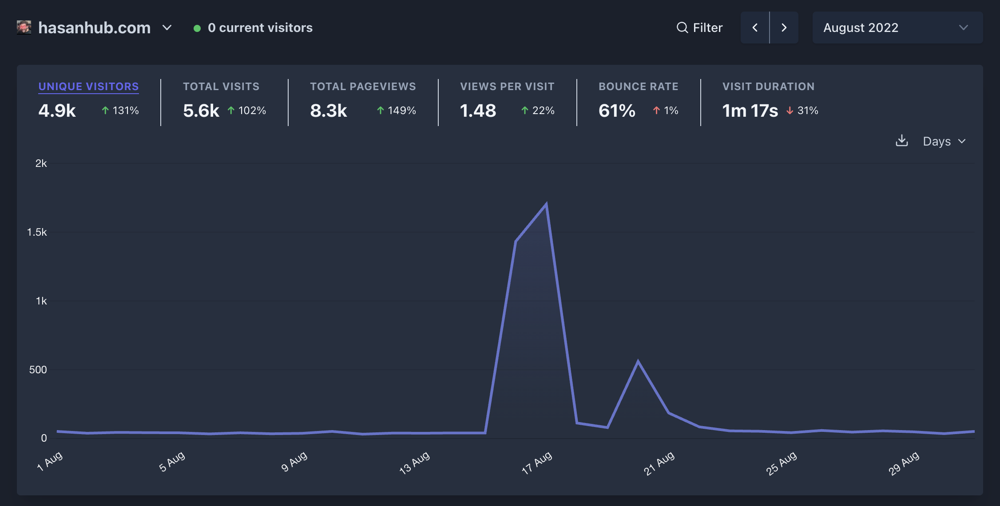
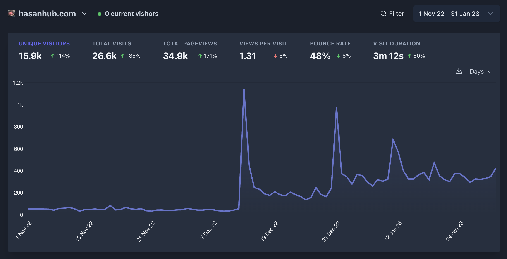

import { Tweet } from "@astro-community/astro-embed-twitter";

- **Link:** <a href="https://hasanhub.com/" target="_blank" rel="noreferrer noopener">hasanhub.com</a>
- **Stack:** Typescript, Remix, Tailwind, MySQL, Prisma, Tailwind, Vercel, Planetscale, Plausible.

Hasan Piker (Hasanabi) is a political commentator and streamer on Twitch.
He streams 6 days a week for aroud 8 hours a day.

He has a large number of channels that clip his content and upload it to Youtube. Hasanhub is a website that aggregates all of these channels into one place.

I had the inital idea for Hasanhub in late 2021. I was watching Hasanabi on Twitch and noticed that he had a lot of channels that clipped his content. I thought it would be cool to have a website that aggregated all of these channels into one place.

I built the initial version of Hasanhub in February 2022 while I had Covid and was bored.

## Launch

Hasanhub was launched in April 2022. It was tweeted out by Hasanabi and got around 50-100 daily users. Hasanabi looked at it on stream and said he liked it.

<Tweet id="https://x.com/chrcit/status/1519797007904346115" />

I also posted it on Reddit and it got a lot of upvotes.

<blockquote
  class="reddit-embed-bq"
  style="min-height:616px"
  data-embed-height="616"
>
  <a href="https://www.reddit.com/r/Hasan_Piker/comments/udw724/i_created_a_web_app_to_organise_the_hasanabi/">
    I created a web app to organise the HasanAbi Clips Industrial Complex (link
    in the comments)
  </a>
    by<a href="https://www.reddit.com/user/chrcit/">u/chrcit</a> in<a href="https://www.reddit.com/r/Hasan_Piker/">Hasan_Piker</a>
</blockquote>

## Launching v1.1 and making my first online $$$ 

Shortly after the initial launch I refactored the codebase from Next to Remix and added some extra features.

I also added a donate button to the website. I used <a href="https://www.buymeacoffee.com/chrcit" target="_blank" rel="noopener noreferrer">Buy Me A Coffee</a> to handle the donations. After announcing v1.1 people donated around $60.

<Tweet id="https://x.com/chrcit/status/1526685682986586112" />

<Tweet id="https://x.com/chrcit/status/1526616860384444417" />

I again posted it on Reddit and it got a lot of upvotes.

<blockquote
  class="reddit-embed-bq"
  style="min-height:560px"
  data-embed-height="560"
>
  <a href="https://www.reddit.com/r/Hasan_Piker/comments/urrlgz/hasanhub_v11_is_live_now_with_duration_filters/">
    HasanHub v1.1 is live! Now with duration filters, multi tag selection and
    Hasan's Twitch schedule
  </a>
    by<a href="https://www.reddit.com/user/chrcit/">u/chrcit</a> in<a href="https://www.reddit.com/r/Hasan_Piker/">Hasan_Piker</a>
</blockquote>

## Posting on /r/reactjs

I decided to post about Hasanhub on Reddit again but this time on <a href="https://reddit.com/r/reactjs"> /r/reactjs</a>.

<blockquote
  class="reddit-embed-bq"
  style="min-height:500px"
  data-embed-height="240"
>
  <a
    target="_blank"
    rel="noopener noreferrer"
    href="https://www.reddit.com/r/reactjs/comments/wpw90c/i_created_a_web_app_for_a_streamer_and_launched/"
  >
    I created a web app for a streamer and launched it to 30k people
    (details+stats in the comments)
  </a>
    by <a target="_blank" rel="noopener noreferrer" href="https://www.reddit.com/user/chrcit/">
    u/chrcit
  </a> in
  <a
    target="_blank"
    rel="noopener noreferrer"
    href="https://www.reddit.com/r/reactjs/"
  >
    reactjs
  </a>
</blockquote>

## Getting featured again on stream
The active user count on Hasanhub was around 30-50/day. Randomly in December 2022/January 2023 Hasanabi featured Hasanhub on stream. The active user count went up to 300-400/day.

The extra attention lead to people donating $103 in total.

## Creating a Twitter account

Early 2023 I decided to seperate the Hasanhub Twitter account from my personal account. I created <a href="https://twitter.com/hasanhub_com" target="_blank" rel="noopener noreferrer">@hasanhub_com</a> to post Hasan related content.

<Tweet id="https://x.com/hasanhub_com/status/1620860774414692352" />

<Tweet id="https://x.com/hasanhub_com/status/1623636677158641665" />

<Tweet id="https://x.com/hasanhub_com/status/1625506258332577795" />

<Tweet id="https://x.com/hasanhub_com/status/1629528934525091841" />

