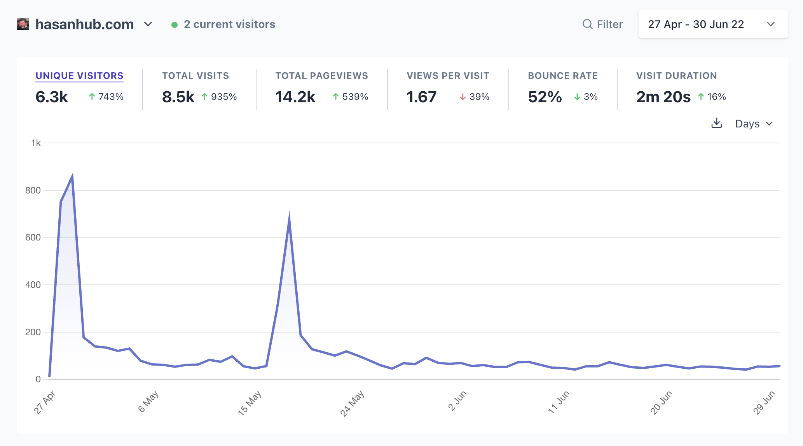

import { YouTube } from "@astro-community/astro-embed-youtube";
import { Tweet } from "@astro-community/astro-embed-twitter";
import ExternalLink from "../../components/ExternalLink.astro";

- **Link:** <ExternalLink href="https://hasanhub.com/">hasanhub.com</ExternalLink>
- **Timeline:** April 2022 - 
- **Stack:** Typescript, Remix, MySQL, Prisma, Tailwind, Vercel, Planetscale, Plausible
- **Status:** active

The political streamer <ExternalLink href="https://twitch.tv/hasanabi">Hasanabi</ExternalLink> allows his fans to clip his stream VODs, upload those clips to YouTube and make money from his content.

Due to this there are 100+ different YouTube channels dedicated to him. Some of these fan channels have over 100.000 subscribers. I saw the opportunity to build something useful for his community by creating a web app which aggregates all of these channels into one feed. It's called <ExternalLink href="https://hasanhub.com">hasanhub.com</ExternalLink>.

In February 2022 I built a proof of concept while I had Covid. Over the next few months I iterated on it until it was ready to launch.

## Launch

I first launched the project in April 2022 and Hasan looked at it on his stream while live to roughly 30.000 people.

<Tweet id="https://x.com/chrcit/status/1519797007904346115" />

I also posted it on Reddit:

<blockquote
  class="reddit-embed-bq"
  style="min-height:616px"
  data-embed-height="616"
>
  <ExternalLink href="https://www.reddit.com/r/Hasan_Piker/comments/udw724/i_created_a_web_app_to_organise_the_hasanabi/">
    I created a web app to organise the HasanAbi Clips Industrial Complex (link
    in the comments)
  </ExternalLink>
    by <ExternalLink href="https://www.reddit.com/user/chrcit/">u/chrcit</ExternalLink> in<a href="https://www.reddit.com/r/Hasan_Piker/">Hasan_Piker</a>
</blockquote>

## Launching v1.1 and making my first online $$$ 

Shortly after the initial launch I refactored the codebase from Next to Remix and added some extra features.

I also added a donate button to the website. I used <ExternalLink href="https://www.buymeacoffee.com/chrcit">Buy Me A Coffee</ExternalLink> to handle the donations. After the launch of v1.1 people donated around $60.

<Tweet id="https://x.com/chrcit/status/1526685682986586112" />

<Tweet id="https://x.com/chrcit/status/1526616860384444417" />

I also posted about it on Reddit again:

<blockquote
  class="reddit-embed-bq"
  style="min-height:560px"
  data-embed-height="560"
>
  <a href="https://www.reddit.com/r/Hasan_Piker/comments/urrlgz/hasanhub_v11_is_live_now_with_duration_filters/">
    HasanHub v1.1 is live! Now with duration filters, multi tag selection and
    Hasan's Twitch schedule
  </a>
    by<a href="https://www.reddit.com/user/chrcit/">u/chrcit</a> in<a href="https://www.reddit.com/r/Hasan_Piker/">Hasan_Piker</a>
</blockquote>

## Posting on /r/reactjs
In August 2022 I posted it on <ExternalLink href="https://reddit.com/r/reactjs"> /r/reactjs</ExternalLink>.

<blockquote
  class="reddit-embed-bq"
  style="min-height:500px"
  data-embed-height="240"
>
  <ExternalLink
    href="https://www.reddit.com/r/reactjs/comments/wpw90c/i_created_a_web_app_for_a_streamer_and_launched/"
  >
    I created a web app for a streamer and launched it to 30k people
    (details+stats in the comments)
  </ExternalLink>
    by <ExternalLink href="https://www.reddit.com/user/chrcit/">
    u/chrcit
  </ExternalLink> in
  <ExternalLink
    href="https://www.reddit.com/r/reactjs/"
  >
    reactjs
  </ExternalLink>
</blockquote>

## Getting featured again on stream
The active users stagnated at around 30 per day until in December 2022 and January 2023 Hasan opened it on stream again. After that exposure the active users went up to 300-400 per day.

<YouTube id="https://www.youtube.com/watch?v=x1Am-_2Qg2s" />

The extra attention lead to people again donating $103 in total.

## Creating a Twitter account
Early 2023 I decided to seperate the Hasanhub Twitter account from my personal developer account. I created <ExternalLink href="https://twitter.com/hasanhub_com">@hasanhub_com</ExternalLink> to post Hasan related content.

<Tweet id="https://x.com/hasanhub_com/status/1620860774414692352" />

<Tweet id="https://x.com/hasanhub_com/status/1623636677158641665" />

<Tweet id="https://x.com/hasanhub_com/status/1625506258332577795" />

<Tweet id="https://x.com/hasanhub_com/status/1629528934525091841" />
