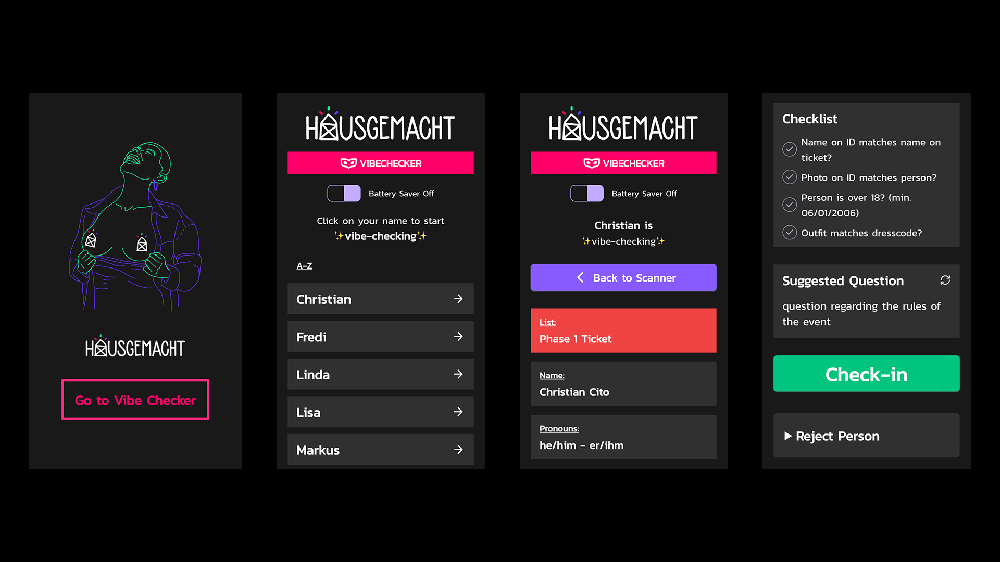

import { Tweet } from "@astro-community/astro-embed-twitter";
import ExternalLink from "../../components/ExternalLink.astro";

- **Link:** <ExternalLink href="https://hausgemacht.org">hausgemacht.org</ExternalLink>
- **Collaborators:** <ExternalLink href="http://apaulin.com">Alois Paulin</ExternalLink>, <ExternalLink href="https://twitter.com/Maybach">Patrick Ludewig</ExternalLink>, Vlad I.
- **Timeline:** April 2023 - 
- **Status:** active
- **Stack:** Typescript, Vite, Remix, Tailwind, C#, SQLite.

## What is hausgemacht?
<ExternalLink href="https://hausgemacht.org">hausgemacht</ExternalLink> ("homemade" in German) is the biggest techno collective in Vienna. They organize events in various clubs in the city.

Besides regular techno clubbings they also host sex positive events. For those partys guests are selected via an application process before the event as well as a strict door policy where the guests are asked questions about the rules of the event.

A big focus of hausgemacht is creating a safeR space for FLINTA\* people. There are awareness teams at the events looking after the safety and well-being of the guests.

## Joining the collective
After attending my first event in February 2023 I decided I wanted to join the collective. I reached out to the team and asked if they needed coding support. 

I met up with the Internet team to get to know each other and talk about the projects they were working on. Afterwards I was invited to join the collective.

## The application process

The application process is handled via a custom made web app built by members of the collective. Because of the sensitive nature of the data the app is built with a strong focus on data protection and privacy.

<ExternalLink href="http://apaulin.com">Alois Paulin</ExternalLink> (one of our members) built the backend which is architected to minimize data stored and disclosed to members of the organisation. There is also great care to ensure that all personal data is encrypted and stored securely. Once the need for the data is gone it is deleted.

<ExternalLink href="https://twitter.com/Maybach">Patrick Ludewig</ExternalLink> designed and built the frontend. Vlad I. acted as a product owner/manager for this and many other projects.

In my first year I focused on refactoring and extending their custom web app for checking in guests.

They were using two different systems:
- A native QR code scanner developed by their event software <ExternalLink href="https://pretix.eu">Pretix</ExternalLink>
- A web app which connects to a passport scanner via websockets and looks up the ticket and guest data via a custom backend

## Anonymous check-in via a passport scanner

The passport scanner web app was built to offer the guests a private check-in experience where even members of the collective don't see the guest's name. 

The app connects to the passport scanner and reads out the name and the image stored on the passport chip. The name is matched against the ticket data to confirm the person has a valid ticket. The image is used to verify the person is the same as on the passport.

The data from the passport (i.e. the image) is only processed and transported in a secure local network. It never leaves the local network and is deleted immediatley after the event.

This approach is quite innovative and Alois even wrote <ExternalLink href="https://dl.acm.org/doi/10.1145/3603304.3604067">a paper</ExternalLink> about it.

<Tweet id="https://x.com/chrcit/status/1699485759038714134" />

Together with Alois I refactored the app to stabilize the integration of the passport scanner and simplify the UI for the end user. We also trialed processing other IDs via OCR.

The improved app was used at our biggest event in June and processed a few hundreds guests.

## Bespoke ticket scanner app
Over the summer we worked on improving the passport scanner app even further and extending it with different features.

A few hours before an event in September a server went down and we didn't have time to port over the backend.

I quickly built a new web app for scanning the ticket QR code and enriching it with our guest data. Our team was then able to use the app to check in or reject guests at the door.

<Tweet id="https://x.com/chrcit/status/1702771997296468365" />

I kept iterating on this app for 2 other events and added many new features. The app is now used at all our events and is the main tool for checking in guests.

The plan is to eventually merge the passport scanner and the ticket scanner app into one application so both methods can be used interchangeably.

## 2024 and beyond
Our focus for 2024 is to unify all our different applications into one unified web applicaton. Over the next 2 years this will evolve into a bespoke event management system for the collective integrating many different tools and services.

