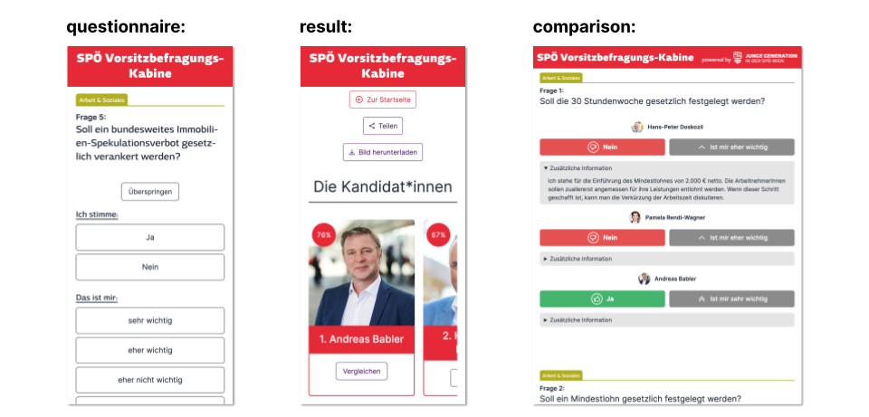
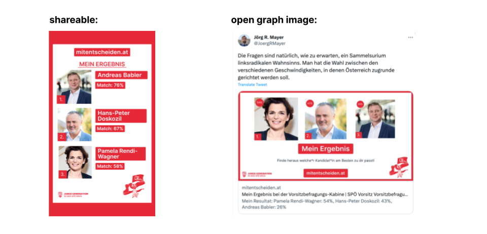

import { Tweet } from "@astro-community/astro-embed-twitter";

**Stack:** Typescript, Next.js, MySQL, Tailwind, Vercel, Planetscale.

- Been political interested for a while
- A friend of mine [georgwindhaber.com](https://georgwindhaber.com) is active at the youth wing of the SPÖ Vienna
- Asked me if I wanted to do a project for them
- Explain the internal election between Pam, Dosko und Babler
- Explain [wahlkabine.at](wahlkabine.at) as concept
- Show in progress screenshots (vercel deployments)
- Results of mitentscheiden.at
  - Use numbers
  - National coverage
- Political results
- 2 months later I held my first dev talk about this project
  - 2 months after that first YT video
- Doskozil flip flop
- Explain what happened with the election (including Excel mistake)
- I joined the organisation and will

## Idea to Launch

[A good friend of mine](https://georgwindhaber.com) is a member of the youth wing of the social democratic party of Austria (SPÖ). I offered to help him out with any web related projects they might have.

At the beginning of April he reached out to me and asked if I wanted to do a project with them.

There was an internal election coming up and they wanted to do a project similar to [wahlkabine.at](wahlkabine.at) (a political quiz) to help their members decide who to vote for.

The election was between 3 candidates:

- [Pamela Rendi-Wagner](https://en.wikipedia.org/wiki/Pamela_Rendi-Wagner)
  - The (then) current party leader and former health minister
- [Hans Peter Doskozil](https://en.wikipedia.org/wiki/Hans_Peter_Doskozil)
  - The governor of a small state and former minister of defense & sport
- [Andreas Babler](https://en.wikipedia.org/wiki/Andreas_Babler)
  - The mayor of a small town

The whole project went from idea to launch in about 3 weeks.

Here is how the project looked like:

The launch was a big success with around ~27.000 people filling out the 42 question quiz. It was covered by [multiple](https://www.puls24.at/news/politik/spoe-wahl-41-fragen-und-die-antworten-von-babler-doskozil-und-rendi-wagner/295388) [national](https://kurier.at/politik/inland/test-fuer-nicht-mitglieder-welcher-spoe-kandidat-wuerde-zu-ihnen-passen/402422507) [newspapers](https://www.derstandard.at/story/2000145782957/was-man-ueber-die-rote-vorsitzwahl-wissen-muss), TV stations and [meme](https://www.instagram.com/p/CrX6u3nMem0/) [pages](https://www.instagram.com/p/CrYPyLWsp7w).

Peak concurrent users was ~550 and it totalled ~45.000 unique visitors with ~200.000 pageviews.

One question resulted in a bit of controversy because Hans-Peter Doskozil changed his answer after the quiz was launched. The question was about removing abortion from the criminal code. He initially answered with "no" but changed it to "yes" after there was a backlash on social media.

A member of his team [took the blame for this on herself](https://x.com/JasminPuchwein/status/1650078502559916036).

## Poll results

Before the actual election was held there was an internal poll where every party member was allowed to participate.

The results were quite close:

- Doskozil: 33.7%
- Babler: 31.5%
- Rendi-Wagner: 31.35%

After coming in last in the poll, Rendi-Wagner decided to not run for re-election.

## Election results

The internal election was held and ~600 officals from the party voted.
Initially the results decided that Doskozil would be the new party leader.

But after a few days it was discovered that there was a [mistake in the Excel sheet](https://www.theguardian.com/world/2023/jun/05/austrian-social-democrats-announce-wrong-leader-after-technical-error) that was used to calculate the results.

The real result was flipped and the Andreas Babler became the new party leader.

## Dev Talk & Youtube Video

In June I also held a talk about this project at the Technical University of Vienna. It went quite well and I decided on posting it on Youtube.

<iframe
  width="560"
  height="315"
  src="https://www.youtube-nocookie.com/embed/LsgIRqjvit0?si=TsrFcIYDGkZxTLx0&amp;controls=0"
  title="YouTube video player"
  frameborder="0"
  allow="accelerometer; autoplay; clipboard-write; encrypted-media; gyroscope; picture-in-picture; web-share"
  allowfullscreen
></iframe>

I also posted it on Reddit and Twitter and it got a good amount of traction.

<Tweet id="https://x.com/chrcit/status/1696141503934943481?s=20" />

<blockquote
  class="reddit-embed-bq"
  style="height:500px"
  data-embed-height="546"
>
  <a href="https://www.reddit.com/r/reactjs/comments/163i0ok/i_made_an_app_which_went_semiviral_and_showcased/">
    I made an app which went (semi)-viral and showcased it in a talk
  </a>
    by<a href="https://www.reddit.com/user/chrcit/">u/chrcit</a> in<a href="https://www.reddit.com/r/reactjs/">reactjs</a>
</blockquote>

## Joining the organisation

I joined the party and the youth wing and founded the Web Task Force together with [Georg Windhaber](https://georgwindhaber.com).

<Tweet id="https://x.com/chrcit/status/1707081180238012491" />

