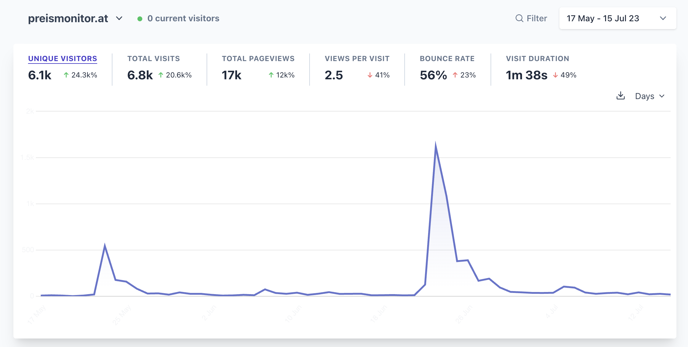

import { Tweet } from "@astro-community/astro-embed-twitter";
import ExternalLink from "../../components/ExternalLink.astro";

- **Link:** <ExternalLink href="https://preismonitor.at">preismonitor.at</ExternalLink>
- **Collaborators:** <ExternalLink href="https://twitter.com/LeKaeferle">Lukas Käferle</ExternalLink>
- **Timeline:** May - October 2023
- **Status:** paused
- **Stack:** Typescript, Next.js, Node, Prisma, Kysely, Planetscale, Tailwind

Preismonitor is a website that ~shows~ showed the development of grocery prices in Austria. I developed it in collaboration with <ExternalLink href="https://twitter.com/LeKaeferle">Lukas Käferle</ExternalLink>.

## Idea
In 2022 and 2023 inflation was rising in Austria and all over the world. A big driver was the increase in grocery prices.

In May 2023 Martin Kocher, the Austrian minister of Labour and Economy, announced a plan to build a state backed grocery price tracker for selected products.

The details were vague and project would maybe launch in the fall of 2023.

A good friend of mine, <ExternalLink href="https://twitter.com/LeKaeferle">Lukas Käferle</ExternalLink>, suggested that we should just build this ourselves.

We went from idea to launch in 2 weeks. The site is called <ExternalLink href="https://preismonitor.at">preismonitor.at</ExternalLink> and it's a simple website which shows the price development of ~300 products in 3 supermarkets.

## Launch

Even though we launched as fast as possible there were 3 other price trackers that launched before us:

- <ExternalLink href="https://heisse-preise">heisse-preisse.io</ExternalLink> by <ExternalLink href="https://twitter.com/badlogicgames">Mario Zechner</ExternalLink>
- <ExternalLink href="https://teuerungsportal.at">teuerungsportal.at</ExternalLink> by <ExternalLink href="https://twitter.com/_zumpel">Bernhard Ruckenstuhl</ExternalLink>
- <ExternalLink href="https://preisrunter.at">preisrunter.at</ExternalLink> by <ExternalLink href="https://twitter.com/DerDavidus">David Wurm</ExternalLink>

At first we were a bit disappointed that we weren't the first to launch but then realised that we can gain more from collaborating than competing. I then reached out to all of them and we started a group chat.

Both Lukas and I were quite busy with different projects and didn't have too much time to develop the project further. Due to the other projects existing as well there wasn't too much need for us to continue developing.

We still got a few mentions in both national and international media:
- <ExternalLink href="https://www.wired.com/story/heisse-preise-food-prices/">Wired</ExternalLink>
- <ExternalLink href="https://www.derstandard.at/story/3000000176002/l">DerStandard</ExternalLink> 
- <ExternalLink href="https://kurier.at/politik/inland/kocher-lebensmittelpreise-muessen-gemeldet-werden-aber-kein-rechner/402595130">Kurier</ExternalLink>
- <ExternalLink href="https://www.puls24.at/news/wirtschaft/lebensmittel-nach-dem-rabatt-kommt-die-preiserhoehung/300734">Puls24</ExternalLink>

## Shaping a new law
The Austrian <ExternalLink href="https://www.bwb.gv.at/en/">Federal Competition Authority</ExternalLink> was investigating the supermarket industry in Austria and asked us and the other price tracking projects to answer a few questions.

The answers were then used in <ExternalLink href="https://www.bwb.gv.at/fileadmin/user_upload/Fokuspapier_Preisvergleichsplattformen_Sept_2023_barrierefrei_14.09.2023.pdf"> a final report</ExternalLink> which was handed over to Martin Kocher, the minister of Labour and Economy.

The report recommended to create a law which would force supermarkets to report their price data to the ministry which then would make it available via an API.

This would enable developers, researchers and journalists to utilize the data for many different use cases.

<Tweet id="https://x.com/chrcit/status/1706731529022378346?s=20" />

In September the minister for Labour and Economics invited us to consult him on the exact implementation of the law. We were invited together with our friends from <ExternalLink href="https://heisse-preise">heisse-preisse.io</ExternalLink>, <ExternalLink href="https://teuerungsportal.at">teuerungsportal.at</ExternalLink> and <ExternalLink href="https://preisrunter.at">preisrunter.at</ExternalLink>.

<Tweet id="https://x.com/badlogicgames/status/1706692838539325789?s=20" />

## What's coming?
In mid October our crawler stopped working and both Lukas and I were too busy to fix it. We decided to pause development until we have more time.

We are planning on dumping our crawler and instead use the data from <ExternalLink href="https://heisse-preise.io">heisse-preisse.io</ExternalLink> or the government API (if it actually comes).

A long-term idea is to create a grocery list app which is enhanced by this pricing data. This would allow users to see which supermarket is the cheapest for their current grocery list.